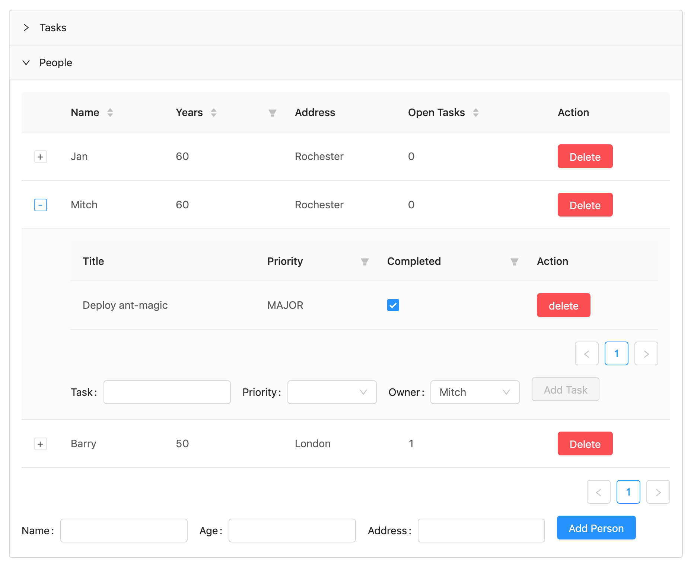

# AntMagic

This is a demo of using the [Ant Design framework](https://ant.design/docs/react/introduce) within [Hyperstack](https://hyperstack.org).  You will need git, Rails, bundler, postgresql, node and yarn installed to proceed.

> If you don't have postgresql installed you can swap in sqlite3 for local development.  Change the gemfile to sqlite3, and use the sqlite3 settings which are commented out at the start of the database.yml file

You should be able to

1. clone the repo,
2. bundle install,
3. yarn install,
3. bundle exec rails db:reset
4. bundle exec foreman start
5. visit localhost:5000

Most of Ant Design is easily accessible to Hyperstack.  Here we use the `Button`, `Form`, `Input`, `Collapse`, `Table` and many other components.

While the `Table` is easily accessible, its data input is a plain (but complex) JSON object. To allow an easy interface between our ActiveRecord models and Ant Tables, we build a `Ant::Table` wrapper, that uses
a modified Ant Design Table column description to pull the data out of our ActiveRecord collection.

The wrapped `Ant::Table` allows for filtering, sorting, conditional rendering, accordion style expansion of table rows, etc.

Like any Hyperstack app, data synchronization between all clients and the server is automatic.

The application has been deployed to Heroku and you can play with it here:  http://antmagic.herokuapp.com/

